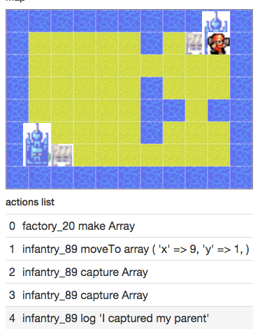

# Forkwars

Forkwars is a turn by turn strategy game based on the Intelligence System success Advance Wars.

Read more about it on http://en.wikipedia.org/wiki/Advance_Wars

The game provide an environment where one can develop and test AI code, against self or other
competitors.

## Disclaimer
This is still work in progress. There's not much you can do with this code right now, except
having an infantry displayed and walking around. Help us make it work !

## Requirements
GNU make, composer

## Installing
```bash
php composer.phar install --prefer-dist
```
You can serve the `web/` folder and have a look at the .php file.
```bash
cd web
php -S localhost:8000
```
And then navigate to [http://localhost:8000](http://localhost:8000) in your favorite browser.



## Testing
Make sure you have phpunit installed somewhere in your PATH. Just run phpunit in the root folder.
```bash
phpunit
```

## Contributing
Fill or solve [issues](https://github.com/lafourchette/forkwars/issues).

## Hall Of Fame
*  [dav-m85](https://github.com/dav-m85)'s original idea
*  [rodrigue67](https://github.com/rodrigue67) for pixi implementation
